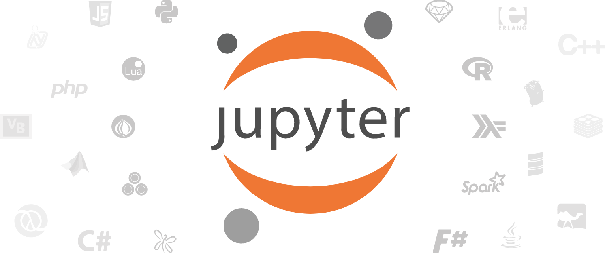

# Awesome Jupyter  

A curated list of awesome [Jupyter](http://jupyter.org) projects, libraries and resources. Jupyter is an open-source web application that allows you to create and share documents that contain live code, equations, visualizations and narrative text.

	 
	
	 
	 

---

	Awesome Jupyter is proudly supported by our sponsor:
	 
	 
	
	 
	 
	<b>Deepnote is a collaborative data science notebook built for teams.</b>
	

	Explore data with Python & SQL from your browser. Add context with data visualizations and rich text editing. Share your work by simply sending a link. <a href="https://deepnote.com/?utm_source=github&utm_medium=promo&utm_campaign=awesomejupyter">Check it out on the Deepnote free plan.</a>
	

---

## Contents

<!--lint ignore awesome-toc alphabetize-lists-->
- [Runtimes/Frontends](#runtimesfrontends)
- [Collaboration/Education](#collaborationeducation)
- [Visualization](#visualization)
- [Tables](#Tables)
- [Rendering/Publishing/Conversion](#renderingpublishingconversion)
- [Version Control](#version-control)
- [JupyterLab Extensions](#jupyterlab-extensions)
- [Testing](#testing)
- [Domain-Specific Projects](#domain-specific-projects)
- [Hosted Notebook Solutions](#hosted-notebook-solutions)
- [Official Resources and Documentation](#official-resources-and-documentation)
- [Community Resources](#community-resources)
- [Articles/Guides/Tutorials](#articlesguidestutorials)
- [Contributing](#contributing)

---

## Runtimes/Frontends

- [Beaker](http://beakerx.com/) - Development environment with seamless data transmission from one language to another.
- [docker-stacks](https://github.com/jupyter/docker-stacks) - Hierarchical stacks of ready-to-run Jupyter applications in Docker.
- [Guild AI](https://my.guild.ai/docs/jupyter-notebook-experiments/) - Execute notebooks as experiments to capture and compare results over time.
- [Hydrogen](https://github.com/nteract/hydrogen) - Run code inline in Atom using Jupyter kernels.
- [Jupyter Notebook](https://github.com/jupyter/notebook) - Main Jupyter notebook runtime.
- [JupyterHub](https://github.com/jupyterhub/jupyterhub) - Multi-user server for Jupyter.
- [JupyterLab](https://github.com/jupyterlab/jupyterlab) - JupyterLab is the next generation user interface for Jupyter.
- [JupyterLab Desktop](https://github.com/jupyterlab/jupyterlab-desktop) - A desktop application for JupyterLab, based on Electron.
- [JupyterWith](https://github.com/tweag/jupyterWith) - Nix-based framework for the definition of declarative and reproducible Jupyter environments.
- [kaggle/docker-python](https://github.com/kaggle/docker-python) - Kaggle Python docker image that includes datasets and packages.
- [ML Workspace](https://github.com/ml-tooling/ml-workspace) - Docker image that includes Jupyter(Lab) and various packages for data science/machine learning.
- [nteract](https://github.com/nteract/nteract) - Native desktop notebook frontend. <!--lint disable double-link-->
- [Panel](https://github.com/holoviz/panel) - Notebooks as static files or interactive and standalone server-/client-side (via pyodide) apps.
- [PaneLite](https://panelite.holoviz.org) - A distribution of [JupyterLite](https://jupyterlite.readthedocs.io/en/latest/) that works with [Panel](https://panel.holoviz.org) and the [HoloViz](https://holoviz.org) ecosystem. <!--lint enable double-link-->
- [Stencila](https://github.com/stencila/stencila) - Native desktop notebook frontend.
- [Visual Studio Code](https://code.visualstudio.com/docs/python/jupyter-support) - Native desktop notebook frontend.
- [voila](https://github.com/voila-dashboards/voila) - Notebooks as interactive standalone web applications.

## Collaboration/Education

- [callgraph](https://github.com/osteele/callgraph) - Magic to display a function call graph.
- [IllumiDesk](https://github.com/IllumiDesk/illumidesk) - Docker-based JupyterHub + LTI + nbgrader distribution for education.
- [IPythonBlocks](https://github.com/jiffyclub/ipythonblocks) - Practice Python with colored grids in Jupyter.
- [jupyter-drive](https://github.com/jupyter/jupyter-drive) - Google drive for Jupyter.
- [jupyter-edx-grader-xblock](https://github.com/ibleducation/jupyter-edx-grader-xblock) - Auto-grade a student assignment created as a Jupyter notebook and write the score in the Open edX gradebook.
- [jupyter-viewer-xblock](https://github.com/ibleducation/jupyter-viewer-xblock) - Fetch and display part of, or an entire Jupyter Notebook in an Open edX XBlock.
- [jupyterquiz](https://github.com/jmshea/jupyterquiz) - An interactive quiz generator for Jupyter notebooks and Jupyter Book.
- [LTI Launch JupyterHub Authenticator](https://github.com/jupyterhub/ltiauthenticator) - Authentication via Edx.
- [nbautoeval](https://github.com/parmentelat/nbautoeval) - Create auto-evaluated exercises.
- [nbgitpuller](https://github.com/jupyterhub/nbgitpuller) - Sync a git repository one-way to a local path.
- [nbgrader](https://github.com/jupyter/nbgrader) - Assigning and grading of Jupyter notebooks.
- [nbtutor](https://github.com/lgpage/nbtutor) - Visualize Python code execution (line-by-line).

## Visualization

- [Altair](https://github.com/altair-viz/altair) - Declarative visualization library for Python, based on [Vega](http://vega.github.io/vega) and [Vega-Lite](https://github.com/vega/vega-lite).
- [anywidget](https://anywidget.dev) - A Python library that simplifies creating and publishing custom Jupyter widgets. 
- [Bokeh](https://bokeh.pydata.org/en/latest/) - Interactive visualization library that targets modern web browsers for presentation.
- [bqplot](https://github.com/bloomberg/bqplot) - Grammar of Graphics-based interactive plotting framework for Jupyter.
- [Evidently](https://github.com/evidentlyai/evidently) - Interactive reports to analyze machine learning models during validation or production monitoring.
- [hvplot](https://hvplot.holoviz.org/) - A familiar and high-level API for data exploration and visualization in Jupyter.
- [ipychart](https://github.com/nicohlr/ipychart) - Interactive Chart.js plots in Jupyter.
- [ipycytoscape](https://github.com/cytoscape/ipycytoscape) - Widget for interactive graph visualization in Jupyter using cytoscape.js. <!--lint disable double-link-->
- [ipydagred3](https://github.com/timkpaine/ipydagred3) - [ipywidgets](https://github.com/jupyter-widgets/ipywidgets) library for drawing directed acyclic graphs in jupyterlab using dagre-d3.  <!--lint enable double-link-->
- [ipyleaflet](https://github.com/jupyter-widgets/ipyleaflet) - Interactive visualization library for Leaflet.js maps in Jupyter notebooks.
- [IPySigma](https://github.com/bsnacks000/IPySigma-Demo) - Prototype network visualization frontend for Jupyter notebooks.
- [ipytree](https://github.com/QuantStack/ipytree/) - Tree UI element for Jupyter.
- [ipyvizzu](https://github.com/vizzuhq/ipyvizzu) - Animated data storytelling tool.
- [ipyvolume](https://github.com/maartenbreddels/ipyvolume) - 3D plotting for Python in Jupyter based on widgets and WebGL.
- [ipywebrtc](https://github.com/maartenbreddels/ipywebrtc) - Video/Audio streaming in Jupyter. <!--lint disable double-link-->
- [ipywidgets](https://github.com/jupyter-widgets/ipywidgets) - UI widgets for Jupyter.  <!--lint enable double-link-->
- [itk-jupyter-widgets](https://github.com/InsightSoftwareConsortium/itk-jupyter-widgets) - Interactive widgets to visualize images in 2D and 3D.
- [jp_doodle](https://github.com/AaronWatters/jp_doodle) - Infrastructure for building special purpose interactive diagrams in 2D and 3D.
- [jupyter-gmaps](https://github.com/pbugnion/gmaps) - Interactive visualization library for Google Maps in Jupyter notebooks.
- [jupyter-manim](https://github.com/krassowski/jupyter-manim) - Display [manim](https://github.com/3b1b/manim) (Mathematical Animation Engine) videos or GIFs in Jupyter notebooks.
- [lux](https://github.com/lux-org/lux) - Recommends a set of visualizations whenever a dataframe is printed in a notebook.
- [mpld3](http://mpld3.github.io) - Combining Matplotlib and D3js for interactive data visualizations.
- [pd-replicator](https://github.com/scwilkinson/pd-replicator) - Copy a pandas DataFrame to the clipboard with one click.
- [Perspective](https://github.com/finos/perspective) - Data visualization and analytics component, especially for large/streaming datasets.
- [pyecharts](https://github.com/pyecharts/pyecharts) - Python interface for the [ECharts](https://github.com/apache/incubator-echarts) visualization library.
- [pythreejs](https://github.com/jovyan/pythreejs) - Python / ThreeJS bridge utilizing the Jupyter widget infrastructure.
- [tqdm](https://github.com/tqdm/tqdm) - Fast, extensible progress bar for loops and iterables.
- [tributary](https://github.com/timkpaine/tributary) - Python data streams with Jupyter support.
- [xleaflet](https://github.com/QuantStack/xleaflet) - C++ Backend for ipyleaflet.
- [xwebrtc](https://github.com/QuantStack/xwebrtc) - C++ Backend for ipywebrtc.
- [xwidgets](https://github.com/QuantStack/xwidgets) - C++ Backend for ipywidgets.

## Tables

- [buckaroo](https://github.com/paddymul/buckaroo) - GUI Data Wrangling tool for Jupyter and pandas.
- [ipyaggrid](https://github.com/widgetti/ipyaggrid) -  The power of ag-Grid in Jupyter.
- [ipydatagrid](https://github.com/bloomberg/ipydatagrid) - Fast datagrid widget for Jupyter.
- [ipyregulartable](https://github.com/jpmorganchase/ipyregulartable) - High performance, editable, stylable datagrids in Jupyter.
- [ipysheet](https://github.com/QuantStack/ipysheet/) - Interactive spreadsheets in Jupyter.
- [ITables](https://github.com/mwouts/itables) - Pandas and Polars DataFrames rendered as interactive [datatables-net](https://datatables.net/) tables.
- [Qgrid](https://github.com/quantopian/qgrid) - Interactive grid for sorting, filtering, and editing DataFrames in Jupyter.

## Rendering/Publishing/Conversion

- [Binder](http://mybinder.org) - Turn a GitHub repo into a collection of interactive notebooks.
- [Bookbook](https://github.com/takluyver/bookbook) - Bookbook converts a set of notebooks in a directory to HTML or PDF, preserving cross references within and between notebooks.
- [ContainDS Dashboards](https://github.com/ideonate/cdsdashboards) - JupyterHub extension to host authenticated scripts or notebooks in any framework (Voilà, Streamlit, Plotly Dash etc).
- [Ganimede](https://github.com/manugraj/ganimede) - Store, version, edit and execute notebooks in sandboxes and integrate them directly via REST interfaces.
- [Jupyter Book](https://github.com/executablebooks/jupyter-book) - Build publication-quality books and documents from computational material.
- [jupyterlab_nbconvert_nocode](https://github.com/timkpaine/jupyterlab_nbconvert_nocode) - NBConvert exporters for PDF/HTML export without code cells.
- [Jupytext](https://github.com/mwouts/jupytext) - Convert and synchronize notebooks with text formats (e.g. Python or Markdown files) that work well under version control.
- [jut](https://github.com/kracekumar/jut) - CLI to nicely display notebooks in the terminal.
- [Kapitsa](https://github.com/gitjeff05/kapitsa) - CLI to search local Jupyter notebooks.
- [Mercury](https://github.com/mljar/mercury) - Convert notebooks into web applications.
- [nbconvert](https://nbconvert.readthedocs.io) - Convert notebooks to other formats.
- [nbdev](https://github.com/fastai/nbdev) - Develop, package and distribute Python packages to PyPI using Jupyter as a [Literate Programing](https://en.wikipedia.org/wiki/Literate_programming) environment.
- [nbflow](https://github.com/jhamrick/nbflow) - One-button reproducible workflows with Jupyter and Scons.
- [nbinteract](https://www.nbinteract.com) - Create interactive webpages from Jupyter notebooks.
- [nbscan](https://github.com/conery/nbscan) - Search for and print cells contents of Jupyter notebooks.
- [Nikola](https://getnikola.com) - Static Site Generator that converts notebooks into websites.
- [notedown](https://github.com/aaren/notedown/) - Convert Jupyter notebooks to markdown (and back).
- [Papermill](https://github.com/nteract/papermill) - Tool for parameterizing, executing, and analyzing Jupyter notebooks.
- [Ploomber](https://github.com/ploomber/ploomber) - Run a collection of notebooks and scripts in a reproducible manner using a `pipeline.yaml` file.
- [pynb](https://github.com/minodes/pynb) - Jupyter Notebooks as plain Python code with embedded Markdown text.
- [RISE](https://github.com/damianavila/RISE) - Reveal.js Jupyter/IPython Slideshow.
- [rst2ipynb](https://github.com/nthiery/rst-to-ipynb) - Convert standalone reStructuredText files to Jupyter notebook file.
- [Voila](https://github.com/QuantStack/voila) - Rendering of live Jupyter Notebooks with interactive widgets, allowing dashboarding based on Jupyter Notebooks.

## Version Control

- [databooks](https://github.com/datarootsio/databooks) - A command-line utility that eases versioning and sharing of notebooks.
- [git](https://github.com/jupyterlab/jupyterlab-git) - Extension for git integration.
- [jupyter-nbrequirements](https://github.com/thoth-station/jupyter-nbrequirements/) - Dependency management and optimization in Jupyter Notebooks.
- [nbdime](https://github.com/jupyter/nbdime) - Tools for diffing and merging of Jupyter notebooks.
- [nbQA](https://github.com/nbQA-dev/nbQA) - Run any standard Python code quality tool on a Jupyter Notebook, from the command-line or via pre-commit.
- [Neptune](https://docs.neptune.ai/integrations-and-supported-tools/ide-and-notebooks/jupyter-lab-and-jupyter-notebook) - Version, manage and share notebook checkpoints in your projects.
- [ReviewNB](https://www.reviewnb.com/) - Code reviews for Jupyter Notebooks.

## JupyterLab Extensions

- [amphi-etl](https://github.com/amphi-ai/amphi-etl) - Low-code ETL extension for Jupyterlab.
- [celltags](https://github.com/jupyterlab/jupyterlab-celltags) - Extension to organise and execute notebooks using cell tags.
- [code_formatter](https://github.com/ryantam626/jupyterlab_code_formatter) - A universal code formatter.
- [debugger](https://github.com/jupyterlab/debugger) - A visual debugger for Jupyter notebooks, consoles, and source files.
- [drawio](https://github.com/QuantStack/jupyterlab-drawio) - Extension that displays drawio/mxgraph diagrams.
- [elyra](https://github.com/elyra-ai/elyra) - A visual editor for creating and running notebook (or Python script) pipelines locally or remotely.
- [genv](https://github.com/run-ai/jupyterlab_genv) - Extension for managing GPU environments in JupyterLab.
- [go-to-definition](https://github.com/krassowski/jupyterlab-go-to-definition) - Extension for navigating to the definition of a variable or function in JupyterLab.
- [google-drive](https://github.com/jupyterlab/jupyterlab-google-drive) - Extension for Google Drive integration.
- [jupyter-ai](https://github.com/jupyterlab/jupyter-ai) - Work with generative AIs (wide range of models supported) as a conversational assistant in JupyterLab.
- [jupyter-fs](https://github.com/jpmorganchase/jupyter-fs) - A filesystem-like content manager for multiple backends in Jupyter.
- [jupyter-notify](https://github.com/ShopRunner/jupyter-notify) - Cell magic for browser notification of cell completion. <!--lint disable double-link-->
- [jupyter-panel-proxy](https://github.com/holoviz/jupyter-panel-proxy) - Automatically serve notebooks as [Panel](https://panel.holoviz.org) data apps at the `/panel` endpoint of your Jupyter server. <!--lint enable double-link-->
- [jupyter-stack-trace](https://github.com/teticio/jupyter-stack-trace) - Click on the stack trace to open the respective file or a Google search.
- [jupyterlab-executor](https://github.com/gavincyi/jupyterlab-executor) - Extension to execute scripts from the Jupyterlab file browser. <!--lint disable double-link-->
- [jupyterlab-kyso](https://github.com/kyso-io/jupyterlab-extension) - Extension to publish notebooks to the [Kyso](https://kyso.io) platform from Jupyterlab. <!--lint enable double-link-->
- [jupyterlab-notifications](https://github.com/mwakaba2/jupyterlab-notifications) - Customizable notebook cell completion browser notifications for JupyterLab.
- [jupyterlab-tensorboard-pro](https://github.com/HFAiLab/jupyterlab_tensorboard_pro) - TensorBoard support for JupyterLab.
- [jupyterlab_autoversion](https://github.com/timkpaine/jupyterlab_autoversion) - Automatically version notebooks in JupyterLab.
- [jupyterlab_commands](https://github.com/timkpaine/jupyterlab_commands) - Add arbitrary python commands to the JupyterLab command palette.
- [jupyterlab_email](https://github.com/timkpaine/jupyterlab_email) - Email notebooks and their content from within JupyterLab.
- [jupyterlab_iframe](https://github.com/timkpaine/jupyterlab_iframe) - View HTML as an embedded iframe in JupyterLab.
- [jupyterlab_miami_nights](https://github.com/timkpaine/jupyterlab_miami_nights) - Combination of VS Code's SynthWave '84 and JupyterLab's Neon Night themes.
- [jupyterlab_templates](https://github.com/jpmorganchase/jupyterlab_templates) - Notebook templates in JupyterLab.
- [latex](https://github.com/jupyterlab/jupyterlab-latex) - Extension for live editing of LaTeX documents.
- [lineapy](https://github.com/LineaLabs/lineapy) - Extension for transforming messy Jupyter notebooks to production-ready pipelines with two lines of code.
- [lsp](https://github.com/krassowski/jupyterlab-lsp) - IDE-like features (code navigation, hover suggestions, linters, diagnostics, kernel-less autocompletion etc.)
- [nb_black](https://github.com/dnanhkhoa/nb_black) - Extension to keep Python code automatically formatted using [black](https://github.com/psf/black).
- [python-bytecode](https://github.com/jtpio/jupyterlab-python-bytecode) - Explore CPython Bytecode in JupyterLab.
- [quickopen](https://github.com/parente/jupyterlab-quickopen) - Quickly open a file in JupyterLab by typing part of its name.
- [shortcutui](https://github.com/jupyterlab/jupyterlab-shortcutui) - An extension for managing keyboard shortcuts.
- [sidecar](https://github.com/jupyter-widgets/jupyterlab-sidecar) - A sidecar output widget for JupyterLab.
- [sql](https://github.com/pbugnion/jupyterlab-sql) - SQL GUI for JupyterLab.
- [stickyland](https://github.com/xiaohk/stickyland) - Break the linear presentation of notebooks with sticky cells.
- [system-monitor](https://github.com/jtpio/jupyterlab-system-monitor) - Extension to display system metrics.
- [tabnine](https://github.com/codota/tabnine-jupyterlab) - Tabnine AI auto completer extension.
- [theme-darcula](https://github.com/telamonian/theme-darcula) - A handsome Darcula theme for Jupyterlab.
- [toc](https://github.com/jupyterlab/jupyterlab-toc) - Extension that provides a table of contents for notebooks.
- [topbar](https://github.com/jtpio/jupyterlab-topbar) - Top Bar extension for JupyterLab.
- [variableinspector](https://github.com/lckr/jupyterlab-variableInspector) - Variable inspector extension that shows variables and their values.
- [vim](https://github.com/jwkvam/jupyterlab-vim) - Vim notebook cell bindings.
- [voyager](https://github.com/altair-viz/jupyterlab_voyager) - Extension to view CSV and JSON data in [Voyager](http://vega.github.io/voyager/).

## Testing

- [ipytest](https://github.com/chmp/ipytest) - Test runner for running unit tests from within a notebook.
- [nbcelltests](https://github.com/jpmorganchase/nbcelltests) - Cell-by-cell testing for notebooks in Jupyter.
- [nbval](https://github.com/computationalmodelling/nbval) - Py.test plugin for validating Jupyter notebooks.
- [nosebook](https://github.com/bollwyvl/nosebook) - Nose plugin for finding and running IPython notebooks as nose tests.
- [sphinxcontrib-jupyter](https://github.com/QuantEcon/sphinxcontrib-jupyter) - Sphinx extension for generating Jupyter notebooks.
- [treebeard](https://github.com/treebeardtech/treebeard) - GitHub Action for testing/scheduling Jupyter notebooks.
- [treon](https://github.com/ReviewNB/treon) - Easy-to-use test framework for Jupyter Notebooks.

## Domain-Specific Projects

- [ArcGIS](https://developers.arcgis.com/python/) - Library for working with maps and geospatial data, powered by web GIS.
- [GenePattern Notebook](http://genepattern-notebook.org) - Integrating Genomic Analysis with Interactive Notebooks.
- [GeoNotebook](https://github.com/OpenGeoscience/geonotebook) - Extension for exploratory geospatial analysis.
- [Jupylet](https://github.com/nir/jupylet) - Create 2D and 3D games, graphics, live music and sound interactively in a Jupyter notebook.
- [keplergl](https://docs.kepler.gl/docs/keplergl-jupyter) - Jupyter extension for visual exploration of large-scale geolocation data sets.
- [lolviz](https://github.com/parrt/lolviz) - Data-structure visualization tool for lists of lists, lists, dictionaries.
- [Quantopian Notebooks](https://www.quantopian.com/notebooks/survey) - Jupyter-based platform for financial research.
- [vpython-jupyter](https://github.com/BruceSherwood/vpython-jupyter) - VPython 3D engine running in a Jupyter notebook.
- [xontrib-jupyter](https://github.com/xonsh/xontrib-jupyter) - Jupyter kernel for xonsh, a Python-powered, cross-platform, Unix-gazing shell language.

## Hosted Notebook Solutions

- [Anaconda Enterprise](https://www.anaconda.com/enterprise/) - Multi-user collaboration and one-click deployment of models, notebooks, and dashboards.
- [Azure Notebooks](https://notebooks.azure.com) - Jupyter notebooks running in the cloud on Microsoft Azure.
- [CoCalc](https://cocalc.com) - Notebooks with 17 supported kernel types, course management, LaTeX document authoring, simultaneous document editing and integration with the SageMath computer algebra system.
- [DataBlogs](https://www.datablogs.co/) - DataBlogs is an open-source data journalism platform that converts Jupyter notebooks into published articles on the web.
- [DataCamp Workspace](https://www.datacamp.com/workspace) - Jupyter-backed data science notebooks with built-in collaboration and publishing functionality.
- [Deepnote](https://www.deepnote.com) - Jupyter-compatible data science notebook with real-time collaboration, versioning and easy deployment.
- [Domino Data Lab](https://www.dominodatalab.com) - Data science platform with integrated collaboration tools, environment management and compute grid.
- [Google Cloud AI Platform Notebooks](https://cloud.google.com/ai-platform-notebooks) - Managed JupyterLab notebook instances configured with GPU-enabled machine learning frameworks on Google Cloud Platform.
- [Google Cloud Dataproc Jupyter component](https://cloud.google.com/dataproc/docs/concepts/components/jupyter) - Jupyter and JupyterLab for Apache Spark using Google Cloud Dataproc.
- [Google Colaboratory](https://colab.research.google.com) - Cloud-based Jupyter environment aimed at machine learning education and research.  <!--lint disable double-link-->
- [Kyso](https://kyso.io) - Data science platform to publish and share Jupyter notebooks as data blogs and web applications.  <!--lint enable double-link-->
- [Mineo.app](https://mineo.app) - Data Ops platform with Jupyter-compatible notebooks, no code blocks, and support for creating dashboards.
- [Naas](https://naas.ai) - JupyterLab environment with magic scheduling/notification functionality and assets/dependency/secrets management.
- [Noteable](https://noteable.io/) - Noteable is a collaborative notebook to combine code (SQL, Python & R) and interactive visualizations.
- [Paperspace Gradient](https://gradient.run/) - A Jupyter-backed data science IDE with accelerated hardware (GPUs) and MLOps functionality.
- [PAWS](https://wikitech.wikimedia.org/wiki/PAWS) - Jupyter notebook deployment customized for interacting with Wikimedia wikis.
- [Pinggy](https://pinggy.io) - Create a tunnel to your Jupyter instance even if it is behind a firewall or NAT.
- [qBraid Lab](https://docs.qbraid.com/en/latest/lab/getting_started.html) - JupyterLab deployment providing curated software tools and integrations for quantum computing.
- [Saturn Cloud](https://saturncloud.io/) - Move your data science team into the cloud without having to switch tools.

## Official Resources and Documentation

- [Jupyter documentation](https://docs.jupyter.org/en/latest/index.html)
- [Jupyter kernels](https://github.com/jupyter/jupyter/wiki/Jupyter-kernels) - List of all programming languages available as Jupyter kernels.
- [JupyterLab documentation](http://jupyterlab.readthedocs.io/en/stable/index.html)
- [Making kernels for Jupyter](https://jupyter-client.readthedocs.io/en/latest/kernels.html)
- [Try Jupyter](https://try.jupyter.org) - Try Jupyter in your browser.

## Community Resources

- Conference Talks - [PyVideo.org](http://pyvideo.org/search.html?q=jupyter), [JupyterCon](https://www.youtube.com/playlist?list=PL055Epbe6d5aP6Ru42r7hk68GTSaclYgi)
- GitHub - Search: [jupyter](https://github.com/search?type=Repositories&q=jupyter)
- GitHub - Topics: [jupyter](https://github.com/topics/jupyter), [jupyter-kernels](https://github.com/topics/jupyter-kernels), [jupyter-notebook](https://github.com/topics/jupyter-notebook), [jupyterhub](https://github.com/topics/jupyterhub), [jupyterlab](https://github.com/topics/jupyterlab), [jupyterlab-extension](https://github.com/topics/jupyterlab-extension)
- Gitter - [Jupyter Gitter Chatroom](https://gitter.im/jupyter/jupyter)
- [jupyter-map](https://elc.github.io/jupyter-map/) - Map of university institutions that use Jupyter.
- [kandi Kits Topic](https://kandi.openweaver.com/explore/jupyter) - Discover popular Jupyter libraries, top authors, trending project kits, discussions, tutorials & learning resources.  <!--lint disable double-link-->
- Mailing Lists - [Jupyter General Mailing List](https://groups.google.com/forum/#!forum/jupyter), [Jupyter in Education Mailing List](https://groups.google.com/forum/#!forum/jupyter-education) <!--lint enable double-link-->
- PyPI - [``Framework :: Jupyter``](https://pypi.org/search/?&c=Framework+%3A%3A+Jupyter)
is the PyPI trove classifier for Jupyter projects.
- Reddit - Subreddits: [r/IPython](https://www.reddit.com/r/IPython/), [r/Jupyter/](https://www.reddit.com/r/Jupyter/)
- Stack Overflow - Tags: [jupyter](https://stackoverflow.com/questions/tagged/jupyter), [jupyter-notebook](https://stackoverflow.com/questions/tagged/jupyter-notebook)

## Articles/Guides/Tutorials

- [Exploratory computing with Python](http://mbakker7.github.io/exploratory_computing_with_python/) - Collection of notebooks covering scientific computing.
- [How to Grow Neat Software Architecture out of Jupyter Notebooks](https://github.com/guillaume-chevalier/How-to-Grow-Neat-Software-Architecture-out-of-Jupyter-Notebooks) - Article and [video](https://www.youtube.com/watch?v=K4QN27IKr0g) about growing a neat software architecture from notebooks.
- [Install and run a Jupyter notebook in a Google Cloud Dataproc cluster](https://cloud.google.com/dataproc/docs/tutorials/jupyter-notebook)
- [Interactive Web Plotting with Bokeh](https://github.com/bokeh/bokeh-notebooks)
- [Jupyter Notebook Extensions](http://jupyter-contrib-nbextensions.readthedocs.io)
- [Jupyter Notebook Themes](https://github.com/dunovank/jupyter-themes)
- [Jupyter tips, tricks and shortcuts](https://www.dataquest.io/blog/jupyter-notebook-tips-tricks-shortcuts/)
- [JupyterLab - Your Personal Data Science Workbench](https://github.com/markusschanta/talks/tree/master/2018-03%20-%20JupyterLab%20-%20Full%20Stack%20Quants) - Talk about JupyterLab at Full Stack Quants London.
- [Lectures on scientific computing with Python](https://github.com/jrjohansson/scientific-python-lectures)
- [List of Jupyter notebooks](https://github.com/jupyter/jupyter/wiki/A-gallery-of-interesting-Jupyter-Notebooks)
- [List of Jupyter notebooks II](https://github.com/jupyter-naas/awesome-notebooks)
- [pytudes](https://github.com/norvig/pytudes) - List of Jupyter Notebooks by Peter Norvig.
- [ResGuides: research with Jupyter](https://www.gitbook.com/book/dansand/resguides-research-with-jupyter/details)
- [Sharing Jupyter Notebooks from localhost](https://pinggy.io/blog/share_jupyter_notebook_from_localhost/) - Sharing Jupyter Notebooks from localhost.
- [The Littlest JupyterHub](https://the-littlest-jupyterhub.readthedocs.io/en/latest/) - JupyterHub distribution for 1-50 users on a single server; more lightweight than the Zero to JupyterHub setup.
- [Zero to JupyterHub](http://zero-to-jupyterhub.readthedocs.io/en/latest/) - Tutorial to help install and manage JupyterHub.

## Contributing

Your contributions are always welcome! Please take a look at the [contribution guidelines](CONTRIBUTING.md) first.
